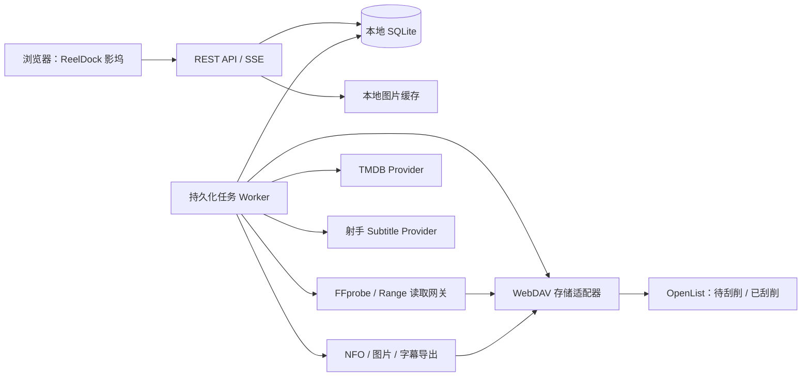

# ReelDock · 影坞：总体实现方案

设计日期：2026-10-08。本文描述计划实现的行为；并非已交付功能清单。

## 1. 定位与边界

ReelDock 是管理远程片源的 Web 应用，运行在飞牛 NAS 的 Docker 容器中。片源及刮削产物保存在 OpenList WebDAV；本机仅持久化配置、任务数据库、日志和可重建缓存。

首期覆盖电影及常规季集电视剧，优先兼容 Kodi。采用一个 WebDAV 连接下的待刮削路径和已刮削路径，建议两者处于同一 OpenList 存储挂载、同一实际后端。跨挂载移动的能力不能由 URL 的相同主机名推断，必须用实际驱动验证。

首期不实现播放、转码、OCR、语音识别、硬字幕识别、蓝光原盘 / ISO、跨存储视频搬运、多用户权限体系及电视剧目录自动合并。遇到这些结构保留原目录并标记需要处理。

### 已确认的需求解释

1. 默认语言指**视频文件实际默认音轨的语言**，不能用 TMDB 的原始语言替代。
2. 已有有效外挂字幕可以是任意语言；自动补字幕优先简体中文。
3. 内置字幕只有确认是完整的简体中文字幕时才免下载。纯 forced 字幕或解说字幕不能代替完整对白字幕。
4. 归档对象是一个独立媒体包目录；包内所有纳入管理的媒体都必须满足成功条件。
5. Kodi 为首要兼容目标；其它播放器的 NFO / 演员图片支持要单独验证。

## 2. 技术栈与部署结构

| 层次 | 选型 | 理由及限制 |
| --- | --- | --- |
| API 与领域逻辑 | Python 3.12、FastAPI、Pydantic | 媒体、字幕和 XML 处理方便，便于扩展 Provider |
| 管理界面 | React、TypeScript、Vite、Ant Design | 适合 tMM 风格的密集表格、目录树、详情侧栏 |
| 服务端数据访问 | HTTPX 异步客户端 | 统一连接池、代理、超时、限流、重定向处理 |
| 数据存储 | SQLite WAL、SQLAlchemy 2、Alembic | 单 NAS 部署依赖少；数据库必须在 NAS 本地磁盘 |
| 后台执行 | 数据库任务表 + 单实例异步 Worker | 租约、检查点、重试均持久化；启动时恢复中断任务 |
| 视频探测 | FFprobe JSON；受控的 FFmpeg 子进程 | 提取音轨、字幕轨、时长、编码；不转码视频 |
| 字幕处理 | pysubs2、charset-normalizer，按需 OpenCC | 检查文本字幕结构及编码；繁简转换不能证明时间轴匹配 |
| 图片处理 | Pillow | 验证格式、尺寸并生成管理界面缩略图 |
| 前后端协议 | REST、SSE、TanStack Query | 查询和命令分离；事件断线后可重新拉取数据库状态 |
| 工具与质量 | uv、pnpm；pytest / respx、Ruff、Vitest、Playwright | 依赖锁定；重点验证归档安全、媒体判定和中断恢复 |
| 交付 | 多阶段 Docker 构建、Compose、GitHub Actions、GHCR | 前端构建后由后端服务；发布固定版本镜像 |

V1 采用模块化单体、一个应用容器、一个 Uvicorn 进程。Worker 在应用生命周期内运行，初始并发 2 个媒体任务，并对媒体包加互斥租约。不依赖 Redis；不能把进度只放在内存或仅使用 FastAPI BackgroundTasks。未来出现多节点需求，再替换队列和数据库。



图中的 API、Worker 和网关是同一应用中的逻辑模块，不要求多个服务。

## 3. 存储与目录识别

### 配置

- WebDAV URL、账号密码、待刮削目录、已刮削目录。
- 默认媒体类型、扫描间隔、稳定等待时间、忽略规则。
- TMDB 凭证、文本语言优先级、图片规格。
- 字幕策略、演员图片策略、任务并发、探测超时与字节预算。
- Kodi 导出配置；可选 NAS 图片服务的固定访问地址。

保存配置时检查路径规范化与层级关系，拒绝待刮削目录等于已刮削目录或两者互相包含，拒绝将 WebDAV 根目录当作单个归档对象。界面分别提供只读连接检查和可明确触发的临时文件写入 / 移动能力检查；临时检查仅操作专用测试目录。

### 扫描与稳定性

使用 `PROPFIND Depth: 1` 分层遍历，处理 DAV 命名空间、转义字符、Unicode 文件名和逐条资源状态，不依赖服务器支持无限深度扫描。读取远程 NFO、海报及字幕的现有状态，在首次扫描时即可展示“已存在 / 待校验”。

归档单位默认是待刮削目录下的独立媒体子目录，使用持续存在的 package ID；视频使用独立 media ID。电影一片一目录。电视剧根目录可以包含季目录，扫描到的每集分别建记录。

稳定条件为至少两次扫描的媒体路径集合、大小和可用版本信息一致，间隔可配置，建议初值 10 分钟；排除 `.part`、`.tmp`、`.!qB` 等下载中条目。归档前再次比较整个包清单。ETag / mtime 可能缺失或不可靠，记录可信度；下载工具可写完成标记或在结束后整体重命名入待刮削区，可靠性更好。不能仅凭连续扫描完全排除第三方写入，需约定归档时不再修改媒体包。

散放在扫描根目录的视频可识别和展示，但自动移动前要求用户整理成独立包，避免误移动公共目录。多个无关电影混在同一目录时也进入待确认。

电视剧只要求当前稳定包内实际存在的集数全部通过，不要求 TMDB 上所有已播出或未来集数都存在。归档后新增季集作为新包处理；若目标已存在，V1 阻塞并提示人工处理，后续版本再实现安全合并。

## 4. Provider 与领域模型

三类接口独立：

```text
StorageProvider
  list / stat / read_range / read_small / put / move / capabilities

MetadataProvider
  search / movie_details / series_details / season_details
  episode_details / credits / images

SubtitleProvider
  search(video_fingerprint, episode_context) / download(candidate)
```

Provider 返回统一的 Movie、Series、Episode、Person、Artwork、SubtitleCandidate 模型，保留来源、外部 ID 和原始响应缓存。NFO 输出由独立 Exporter 负责，业务规则不直接依赖 TMDB JSON，也不依赖某个 WebDAV 客户端的对象类型。

### TMDB 识别

先使用文件名中明确的 TMDB / IMDb ID、已确认的 NFO ID；没有明确 ID 时解析标题、年份和季集信息，再搜索对应电影或剧集。对候选按标题、年份和媒体类型评分，低置信度进入待确认，界面支持手动指定 TMDB ID。错误 ID、电影 / 剧集混淆、季集号不明确不得静默取第一个结果。

文本优先 `zh-CN`，空字段按需回退到原始语言、再英语，并记录字段来源。图片候选优先中文，再无语言文字的图片，再其它语言；接口参数使用 `include_image_language`，不能把“只查询中文”导致的空结果等同于没有图片。图片 URL 按 TMDB configuration 返回的基址和规格构造。

缓存搜索、详情、演员和图片结果，设置本地并发限制、指数退避与抖动，遵守 429 / Retry-After，不把历史限流数写死成服务保证。TMDB 没有海报或背景图时，该必需项明确失败；人工提供且通过校验的替代图片可满足要求。

## 5. 音轨与字幕判定

### 远程探测

FFprobe 输出音轨 / 字幕轨的 index、language、title、default / forced disposition、codec、时长。`ffprobe` 访问仅绑定容器回环地址的内部读取网关；网关通过 media ID 解析已经登记的 WebDAV 对象并执行 Range 请求，限制读取量和运行时间，避免在子进程参数和日志中暴露 WebDAV 密码。

对音轨优先选择明确的默认轨；无默认标记时按首个音轨作为约定并标识推断来源；多个默认轨、未知语言或明显解说轨冲突进入待确认。中文归一化覆盖 `zh`、`zho`、`chi`、`cmn`、`yue` 等已识别中文语言标签，结合轨道 title；音轨的“中文”不区分繁简。

内置字幕中的 `zh/chi/zho` 只能证明中文标记，不能证明简体。优先识别 `zh-Hans`、`chs`、明确的简体 title；证据冲突时不豁免。对文本字幕可在预算内抽取内容辅助判断；PGS / VobSub 等图片字幕若标签不能说明繁简，V1 不做 OCR。无法确认时尝试补字幕或要求人工确认。

初始探测预算建议 45 秒、64 MiB，均可配置。不同容器的索引位置和远程存储行为不同，不能承诺所有媒体只读头部就可探测。Range 返回 200 整文件、错误 Content-Range、无效长度或超预算时停止读取并展示原因；V1 不自动下载整部电影。源媒体探测及射手哈希读取前后复核长度 / ETag，内容变化则重新等待稳定。

### 必须补字幕的精确定义

```text
need_download =
  default_audio_is_confirmed_non_chinese
  AND NOT verified_full_embedded_zh_hans_subtitle
  AND NOT valid_matching_external_subtitle
```

| 实际情况 | 处理 |
| --- | --- |
| 默认中文音轨 | 字幕项“不需要”，不阻塞归档 |
| 默认非中文 + 有完整内置简体字幕 | 使用内置字幕，不要求额外导出 |
| 默认非中文 + 有有效外挂字幕（任意语言） | 使用现有外挂字幕，不强制重复下载 |
| 默认非中文 + 仅内置繁体 / 英文 / forced 字幕，无外挂 | 必须补齐外挂字幕 |
| 默认语言未知、字幕性质存在冲突 | 待确认，不能自动归档 |
| 必须下载但没有命中、下载失败或文件无效 | 阻塞，留在原目录，可重试或人工补齐 |

有效外挂字幕必须与视频 stem 或明确映射关联。支持视频同目录和约定字幕子目录，按语言后缀 / 季集标记匹配；同目录的其它电影字幕不算。文本字幕需能解析、有有效对白与时间轴；已有 `.idx/.sub` 需成对且可验证。时间轴与片长做粗校验并提供预览，无法自动保证对白完全同步；结果不明确进入待确认。

### 射手 API

首期适配历史射手 JSON API，并用独立 Provider 封装协议差异。以视频内容分块 MD5 生成射手指纹，使用正确的 Range 响应，不将文件名哈希当作文件内容哈希。参考实现读取四个 4 KiB 块并按协议顺序组合，偏移为 `4096`、`floor(2 * size / 3)`、`floor(size / 3)`、`size - 8192`；通常有效载荷合计 16 KiB，不包含探测与 HTTP 开销。小文件、越界、短读必须单独处理，并用本地完整文件与远程 Range 的指纹一致性测试定版。

API 返回候选后，下载完整字幕包，验证格式及关联关系，处理编码、延时字段和候选差异。下载优先简体中文 / 中英双语；繁简转换若启用，保留原文件并标识转换来源。若只返回其它语言，按用户已确认的“有效外挂即可”规则验证，不能把改后缀当作简体中文。压缩包需限制展开大小和目录穿越；文本下载返回 HTML 或空内容判失败。API 失败、无匹配、下载失败和解析失败是不同状态。

本地成功查询和下载一个公开测试样本不代表该服务能覆盖所有影视，也不代表 NAS 网络连通；实际网络与真实样本命中率属于 P0 验证内容。找不到字幕时允许人工补齐并重新验证，不能用“跳过失败”满足自动归档条件。

## 6. Kodi 导出与演员头像

### 文件布局示例

电影：

```text
待刮削/
  Example Movie (2024)/
    Example Movie (2024).mkv
    Example Movie (2024).nfo
    poster.jpg
    fanart.jpg
    Example Movie (2024).zh-Hans.srt
    .actors/
      Example_Actor.jpg
    .reeldock/
      manifest.json
```

电视剧：

```text
待刮削/
  Example Series/
    tvshow.nfo
    poster.jpg
    fanart.jpg
    season01-poster.jpg
    .actors/
      Example_Actor.jpg
    Season 01/
      Example Series S01E01.mkv
      Example Series S01E01.nfo
      Example Series S01E01-thumb.jpg
      Example Series S01E01.zh-Hans.ass
    .reeldock/
      manifest.json
```

电影 / 剧集 NFO 和图片以 Kodi 官方约定为基础，季海报放在剧集根目录，首版不要求 `season.nfo`；多集 NFO 等细节按实际 Kodi 版本联调定版。V1 默认保留视频原名，NFO 与其 stem 对应。

### NFO

按 Kodi movie / tvshow / episodedetails 输出 UTF-8 XML，包含标题、原名、年份、简介、类型、评分、演职员、媒体参数和外部 uniqueid；季集编号和剧集关系要正确。XML 转义用标准序列化器。记录生成器版本、配置版本和数据来源，更新时保留用户已编辑内容及观看进度；有现存 NFO 时先读回验证与 ID 一致性，冲突时备份或等待用户选择，不能静默覆盖。

### 演员头像的默认方案

Kodi 的 `.actors` 目录是官方文档支持的本地演员图片约定。首期将演员头像下载到本地共享缓存，再复制上传到各电影 / 剧集根目录的 `.actors/` 中，随包一起归档。按 NFO 中演员显示名生成对应文件名（空格变下划线）；目录内重名及平台非法字符需要检测，不能用随意加 ID 的文件名破坏 Kodi 的名字匹配约定。

缓存使用 provider + person ID + profile path / 内容哈希作为键，减少重复下载。WebDAV 上跨目录复用硬链接不能假设可用，允许图片副本换取目录自包含。

Kodi 导出默认避免写入 TMDB 远程演员图片 URL，由播放端读取 `.actors`；相对 `<thumb>` 路径仅在实际版本验证通过时使用，不写容器内部 `/data/...` 绝对路径。验证必须同时覆盖首次入库、信息刷新和禁用播放端外网访问，防止已有 Kodi 缓存掩盖错误。

演员图片成功策略明确区分：

- 默认 `available_only`：抓取所选演员列表中 TMDB 提供了 profile 的所有头像，上传并验证；没有 profile 的演员标记“来源无图 / 不适用”，不伪称成功。
- 可选 `strict`：所选演员必须都有真实头像，来源无图则需人工提供，未补齐不归档。
- 演员范围默认前 20 位，可切换全部；未选择的条目在界面明确标为“未纳入本次要求”。

对于已选且来源有图的演员，下载 / 上传失败属于必需项失败，默认也阻塞归档。“没有来源图”与“下载失败”绝不能合并为一个可忽略状态。

### 其它播放端的备选方案

ReelDock 可提供固定的 `http(s)://NAS:端口/assets/actors/{asset-id}.jpg` 图片地址，asset ID 独立于待刮削 / 已刮削路径；头像字节仍备份在 WebDAV，本地缓存丢失时可按更新后的清单回源。地址不能包含 WebDAV 账号、临时 OpenList 签名链接或 TMDB 凭证。

此方案仍依赖 NAS 服务和播放器能访问固定地址，因此 Kodi 优先采用随片目录图片。确需匿名图片读取时使用单独的只读、不可列举图片端点，和需要登录的管理 / 片源 API 分开；其它播放器能否读取演员 thumb URL、是否覆盖本地缓存，逐一实测后再提供兼容配置。

## 7. 成功条件、上传与移动

### 资产清单

一个包在开始处理时固化当前的 required asset set 与 policy version。默认必需项：

- 每部电影 / 每集正确匹配的有效 NFO；剧集还需剧级 NFO。
- 电影 / 剧级海报和背景图。
- 触发字幕规则时的有效外挂字幕。
- 默认演员策略中应有的演员头像。
- 本次处理清单、所有必需项远程上传及读回校验。

季海报、单集缩略图、Logo、额外背景图初始列为增强项，可配置成必需；源站确实缺少必需海报 / 背景图时保持阻塞并允许人工补图。可选资产不会被界面显示成已刮削成功，规则修改导致 required set 改变时需要重新评估。

```text
ready_to_archive =
  package_is_stable
  AND media_snapshot_unchanged
  AND all_media_have_confirmed_identity
  AND all_required_assets_are_valid_and_remote_verified
  AND subtitle_policy_passes_for_every_media
  AND no_manual_review_pending
  AND destination_has_no_conflict
  AND storage_move_capability_verified
```

“刮削完成”和“归档完成”分别记录，后者必须确认移动结果。

### 持久化流程

```text
发现 → 等待稳定 → 媒体探测 → 识别 / 人工确认 → 获取数据
    → 本地生成及验证 → 上传 → 读回验证 → 就绪
    → 写入移动意图 → MOVE → 核对源 / 目标 → 已归档
```

可进入 `waiting_retry`、`blocked_subtitle`、`needs_review`、`conflict`、`move_unknown`，每一项附阶段、错误码、详情、重试时间。数据库保存阶段检查点和上传清单；同一版本的同一资产不会因重启重新抓取所有数据。

### 上传

1. 本地暂存 NFO、图片和字幕，验证内容，计算 SHA-256。
2. 存储支持时上传为作业专属临时文件，读回比对完整小文件哈希，再发布到最终文件名；临时文件发布能力也需实测。
3. 不支持安全临时发布时，对未存在的最终目标逐个 PUT、读回验证，并记录中断状态；覆盖既有资产必须单独采用备份 / 条件写策略。不能承诺跨文件的原子事务。
4. 使用 PROPFIND / HEAD 检查存在性和大小，但它们不能替代完整小文件读回校验；ETag 不必是内容 MD5。
5. 最后上传经过校验的 `.reeldock/manifest.json`，包含每个资产的相对路径、哈希、来源、策略版本和包 ID；不包含密码和签名下载地址。

### 归档

优先在同一实际存储后端执行服务器端目录 `MOVE`，显式设置 `Overwrite: F`，避免目标目录已存在时被替换。必须解析 207 Multi-Status 中的子项失败，不能把任意 2xx 当作整包成功。源目录的所有文件，包括未参与刮削的附件，都纳入移动前后目录清单核对。

数据库事务不能覆盖远程 HTTP，因此移动前先持久化意图、源目标路径、清单、包 ID 和任务 ID。移动后带有限退避重新读取源与目标，核对媒体文件的相对路径 / 大小 / 可用版本信息及刮削小文件哈希；已刮削清单包含包 ID 才能认定是本任务的目标。视频通常不全文下载做哈希，故媒体完整性依赖经过验证的存储端移动能力，并清楚记录验证等级。

| 恢复时状态 | 行为 |
| --- | --- |
| 源不存在，目标清单与包 ID 正确 | 标记已归档，修复数据库路径 |
| 源完整、目标不存在 | 查明前次请求结果，安全条件成立时可重试 |
| 两者都存在、缺文件、子项部分移动或目标身份不明 | 标记 `move_unknown` / 冲突，人工处理；不自动删源 |
| 两者都不存在 | 严重异常，停止该包并报告 |

OpenList 的具体驱动可能内部以复制 / 删除实现 MOVE，不能承诺协议请求等于原子重命名。V1 不自动退化为客户端整视频下载、上传、删除，也不执行不受控的递归搬运；不支持或未验证移动的后端只能停留在刮削完成状态。

## 8. 数据结构与界面

| 主要表 | 内容 |
| --- | --- |
| storage_profiles / settings | 连接信息、扫描范围、配置及策略版本 |
| packages | 包 ID、源目标路径、当前快照、状态、稳定时间 |
| media_items | 电影 / 集、文件信息、匹配 ID、语言与字幕判定证据 |
| media_streams | 音轨和字幕轨、语言、disposition、探测结果 |
| assets | 类型、必需性、来源、相对路径、哈希、验证状态 |
| jobs / job_steps | 阶段、重试、租约、心跳、幂等键、错误 |
| archive_operations | 归档意图、源目标快照、结果与恢复状态 |
| events / audit_log | 可重放进度及配置 / 人工修订记录 |
| provider_cache | 原始响应、缓存键、过期时间及来源 |

media / package ID 不依赖路径。幂等键包含包 ID、源快照、策略 / 导出器版本；同一包领取任务及归档必须互斥。路径变化用一次本地事务更新关联；重启先对过期租约进行核对，不能直接启动第二次 MOVE。

管理界面采用目录树 / 电影剧集树、状态表和详情侧栏。表格列包含名称、匹配、音轨语言、NFO、海报、背景图、演员头像完成数、内置字幕、外挂字幕、上传校验和归档状态。单集不重复要求剧级海报，而是显示继承来源。

资产状态至少区分：未检查、缺失、已有待验证、处理中、已生成、已上传待验证、远程已验证、失败、不需要、来源无图。图标附文字和说明，不能只靠红绿颜色；悬浮或详情中显示原因和时间。

支持只看失败 / 缺字幕、手动匹配、图片和 NFO 预览、字幕预览、批量启动、暂停队列、按失败步骤重试、人工补文件后重新验证、查看归档阻塞原因。SSE 断线可从 event ID 继续；数据库列表接口始终是状态真相。

## 9. Docker 与飞牛部署

构建阶段生成前端静态文件，运行阶段包含 Python 应用、FFmpeg / FFprobe 和所需基础库。推荐 Debian slim 运行镜像，先交付 `linux/amd64` 并在实际飞牛设备上验收，再在 CI 验证 `linux/arm64`。最终基础镜像和依赖版本在实现时固定并提供锁文件。

规划的 Compose 接口如下，**仅为设计示例，当前无对应可运行镜像**：

```yaml
services:
  reeldock:
    image: ghcr.io/gteall/reeldock:v0.1.0
    user: "${REELDOCK_UID:-1000}:${REELDOCK_GID:-1000}"
    ports:
      - "${REELDOCK_PORT:-8765}:8765"
    environment:
      TZ: Asia/Shanghai
      REELDOCK_DATA_DIR: /data
      REELDOCK_CACHE_DIR: /cache
    volumes:
      - ./data:/data
      - ./cache:/cache
    restart: unless-stopped
    stop_grace_period: 60s
```

数据库及主密钥在 `/data`，本地磁盘 / SSD 上持久化，不挂 WebDAV / 网络文件系统作为 SQLite WAL 数据目录。启动前使目录属主与运行 UID/GID 匹配。缓存 `/cache` 可重建；备份使用 SQLite backup API / 停机备份，避免单独复制活跃的 db 而漏掉 WAL。正式 Compose 补充健康检查、资源限制和日志轮转。

无需特权容器、FUSE 挂载、宿主机 Docker socket 或 GPU。通过 OpenList 网络 API 读写片源，只有小型刮削产物及探测片段消耗本地空间。容器内的 `localhost` 指自身，连接同 NAS 的 OpenList 使用共享 Docker 网络中的服务名或 NAS 地址。

管理界面首期支持管理员密码、会话认证、修改操作 CSRF / Origin 校验；凭证服务端加密，主密钥持久化于 `/data` 或从外部 secret 注入，日志脱敏。下载仅允许已配置 Provider 和明确许可的重定向目标，不将 API 做成通用 URL 代理，跨域重定向不转发 WebDAV Authorization。

升级前做数据库备份；迁移向前执行，回退旧镜像若不兼容新 schema 则恢复备份。优雅退出停止领取新任务，记录检查点并终止剩余探测子进程；已开始的 MOVE 在重启后核对结果。

## 10. 实施顺序与待验证项

优先交付存储 / 探测验证、电影闭环、字幕门禁、电视剧与状态 UI，最后完成实际飞牛和 Kodi 验收。详细排期见 [开发计划](roadmap.md)，必过用例见 [验收标准](acceptance.md)。

P0 需要实际 OpenList 版本 / 存储驱动、测试路径、网络条件、目标 Kodi 版本，以及包含中文 / 外语音轨、简繁字幕和无字幕情况的测试媒体。当前未提供这些资料，故这里只制定方案并记录可完成的公开 API 验证，不宣称已完成真实环境集成。
